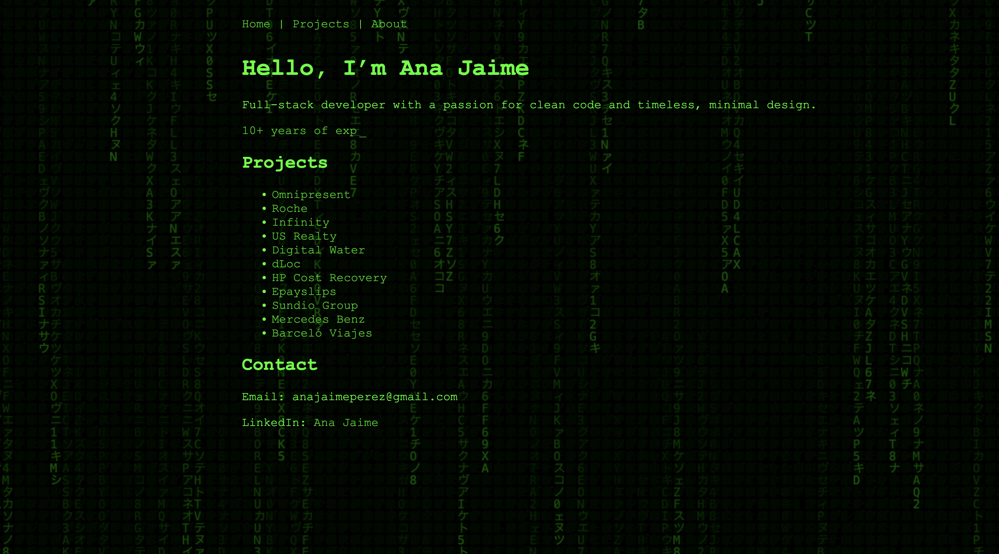

# Ana Jaime – Web Portfolio 💻

This is my personal developer portfolio, built to showcase my work, skills, and experience as a Full-Stack Software Engineer.

## 🚀 Project Overview

The portfolio includes a retro-style interactive design inspired by classic video games (Mario Bros-style), and highlights projects, skills, and contact information in a playful yet professional format.

It was built with modern frontend technologies and structured to be easily expandable and maintainable.

## 🛠️ Tech Stack

- **Frontend:** React, Vite, TypeScript
- **Styling:** Tailwind CSS, Emotion (optional for animations)
- **Routing:** React Router
- **Animation:** Framer Motion
- **Version Control:** Git & GitHub

## 📁 Folder Structure

```bash
src/
├── assets/        # Images, favicons, etc.
├── components/    # Reusable UI components
├── pages/         # About, Projects, Contact, etc.
├── data/          # JSON files with project data
├── App.jsx
├── main.jsx
```

🧩 Features

- Responsive layout
- Dynamic project rendering from JSON
- Smooth scroll and animated transitions
- Styled with Tailwind and retro fonts/icons
- Custom favicon with "Matrix"-style design

📷 Preview


